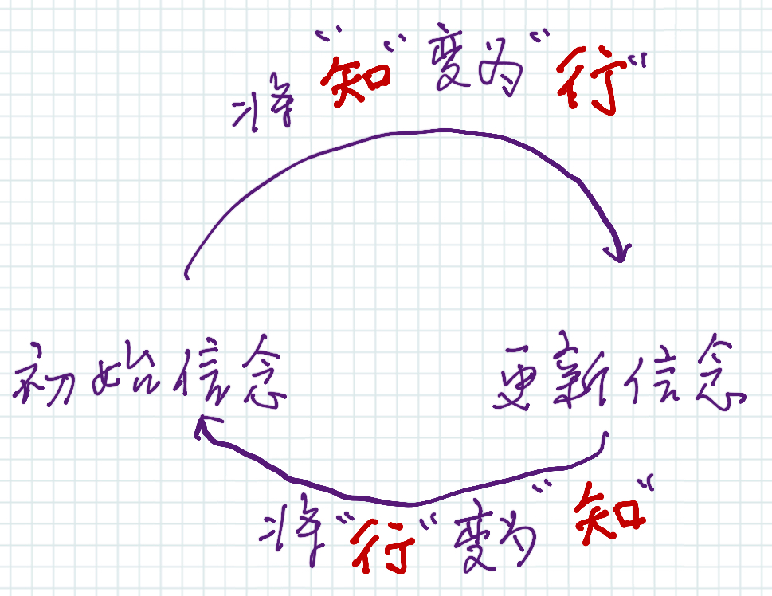

2023/10/20-2023/10/27 封面图摄于香港海洋公园，坐缆车上山时拍下了这张照片。
## 写作的核心
我打算尝试新的写作方式：写作时绝不考虑文笔、风格，而是想象一位朋友坐在对面，向他表达我脑海中的思想和故事。

过去我一直尝试学习写作而不得要领，在某一刻忽然想到：文字的作用是记录，是表达。作为人类史上最重要的发明，文字最大的作用是能穿越时间将知识保存下来，要知道其它生物只能靠基因来积累知识，而人类却依靠文字将一代代的知识积累延续了下来。

思考是写作的灵魂，是真正的创造力所在，如果你能精彩地思考，那你也一定能精彩地写作。文笔、修辞只能起到锦上添花的作用。如果思考没有深度，无论文笔再好，写出来的文章也是空洞乏味的。看看每年高考的高分作文就知道这样的文章是什么样的了，全篇都是词藻堆砌和无病呻吟的抒情，除此之外却是空无一物，这样的文章不是我想要写的。

写作的过程能倒逼思考的质量，如果思考不够深刻，写作的过程就会卡壳，会发现原来自己说不清楚自己想表达的东西。空想固然简单，实践起来却困难重重。以此文为例，本以为我已经思考得足够清楚了，写下来不过是信手拈来。实际上写了不到 400 字就开始卡住，像便秘一样，绞尽脑汁也挤不出一点内容来。写作让人不得不直面最真实的自我，这是个痛苦的过程，你不得不承认自己在这个问题上的思考是如此浅薄。

写作对于我而言依然是一件困难的事情，尤其是结构化的文章。毕竟不像 140 字的微博，即使只表达观点和情绪，也能吸引人阅读。但是一篇文章，如果没有足够的“料”，不能体现作者的思考，只怕是连自己都读不下去。
## 生活需要音乐
上周日去了南头古城音乐节，一个没听过的乐队在舞台上表演。我同场下的听众一起置身于音乐之中，在现场感受到的音乐和耳机播放的是截然不同，摇滚乐的魅力不仅仅来自声音，也来自现场的气氛。随着音乐节律挥舞双手，扭动身体，放声大喊，摇滚乐的美妙在此刻让人陶醉。“那些听不见音乐的人，认为那些跳舞的人疯了“。音乐有神奇的力量，可以直达内心。

## 香港海洋公园
周五去香港海洋公园团建，虽然在深圳呆了这么多年，这其实是我第一次去香港。海洋公园在香港最南端，我们从深圳湾口岸过关，从北到南穿过了整个香港，花了 2 个多小时才抵达海洋公园。

香港汽车是靠左行驶，通关后乍一看到路上的车流感觉脑子转不过来，有种很混乱的感觉，不知道司机怎么能调整过来。

海洋公园的工作人员，包括检票口的大姐、餐厅打饭的阿姨、各个场馆内的员工都能流利地说普通话、粤语和英语，所有的支付方式也都支持微信和支付宝，所以沟通上整体没有任何障碍。从场馆设施来说，海洋公园比不上之前去过的珠海长隆水上乐园，但是海洋公园有他独特的魅力所在，就是周围的人都非常开心，嘴上都挂着笑容，场馆的工作人员、游客互动游戏的小姐姐，以及假扮鬼怪的 npc 都是这样，他们会很热情地和你互动。周围的游客也和我去过的景点有非常明显的区别：他们很快乐。晚上从上山坐缆车下山，我们后面一个车厢是几个讲英语的女孩子，一路上她们都开心地说笑，整个山谷时不时地传来她们地笑声，到最后她们开心地唱起了歌，听着她们的歌声，我也感觉开心了起来。
## 阅读
**[Instead of Your Life's Purpose](https://philosophyinhell.substack.com/p/instead-of-your-lifes-purpose)**
人们常常误解生活的意义，以为我们在生活中有一个特殊的目标，一旦找到它，所有的困惑就会消失。然而，这种方法是不适用于大多数人。像《月亮与六便士》中主人公思特里克兰德那样找到人生目标的人是极其幸运的，与其说是思特里克兰德找到了自己的使命，不如说是他的使命选择了他。

**[真正的高手，都是贝叶斯主义者](https://mp.weixin.qq.com/s/r602dlcLas48ci8oG2Drig)**
贝叶斯公式的核心思想：我们的信念（即事件发生的概率）是可以通过新的证据来更新的，也就是说当我们得到新的信息（事件B发生）时，我们可以利用贝叶斯公式来更新我们对事件A发生的概率的估计。
用贝叶斯公式的思想来指导生活中的决策，可以帮助我们构建起一个在不确定世界中思考和行动的框架。
简单来说可以总结为这几点
- 世界是不确定性的，只能从概率上不断逼近。
- 立即行动，通过行动获取反馈，更新认知，再用新认知指导行动，形成“可纠错的反馈闭环”。
  
  