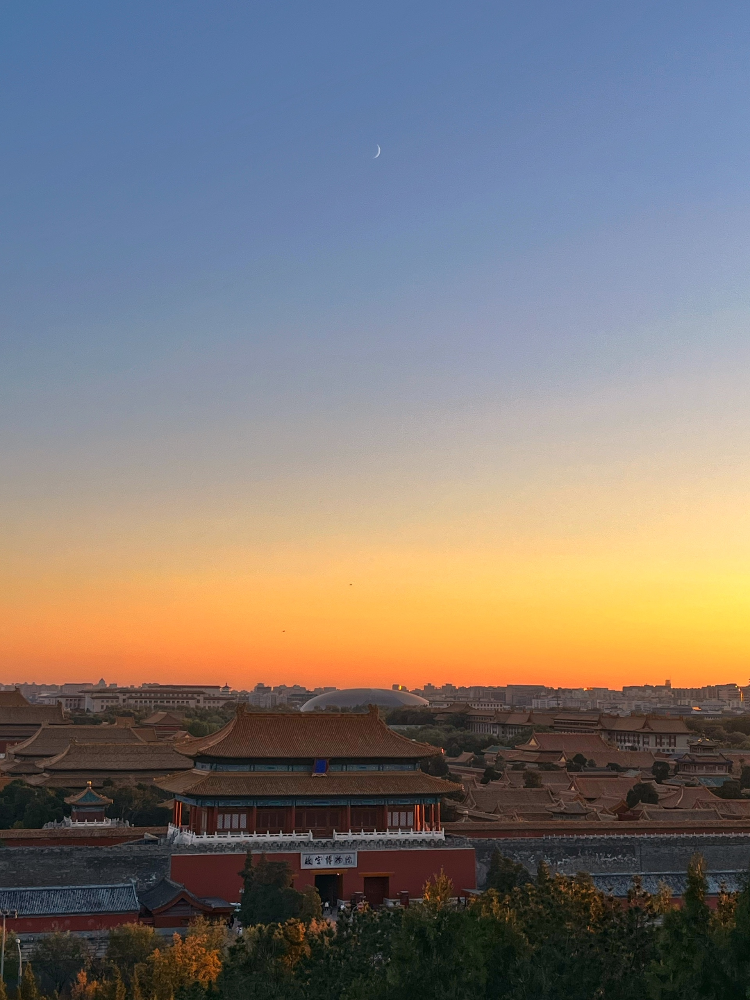

2023/11/11-2023/11/17 封面图是在景山公园拍摄的「日落紫禁城」。

这周出差去了一趟北京。

去的时候比较仓促，到了北京之后游玩的过程也挺赶的，都没来得及计划和记录，这篇周报也是回来之后再写的，只能凭记忆想到哪就写到哪吧。

11.16 当天深圳有 20 多度，而北京已经只有 0℃ 左右了，同事特别嘱咐要带羽绒服，我翻箱倒柜找到了一件大衣，买了好几年还没穿几次，深圳这气候基本没有穿大衣的机会。
从大兴机场下飞机之后感觉还没那么冷，直到走出室内，冷风一吹，直接一个哆嗦，赶紧把大衣拿出来穿上。
  
初到北京和我想象中不太一样，从机场坐地铁到市区，一路上见到的建筑都是矮矮的，房屋楼层都不高，主色调也是以黄色、灰色系为主，第一感觉不像是一线城市，不是像深圳那样的高楼大厦。北京的人感觉也不像上海深圳那样精致，厚厚的羽绒服把整个身体都包裹住了，一眼望去都是单调的黑色。

不过北京是个有意思的地方，周五下午去逛了故宫，在保和殿门口，导游介绍说这是清朝举行殿试的地方，考生进宫时只能走侧面进来，殿试结束后，前三甲可以走平时只有皇帝才能走的正门出去。站在故宫雄伟的宫殿前面很容易想象得到这是多么大的荣耀啊。正所谓：春风得意马蹄疾，一日看尽长安花。

北京是一个关于地位和权力的城市，这座城市散发的信息就是：你要追求更高的地位。光有钱在北京是行不通的，连北京户口都搞不定。相比之下深圳则不一样，深圳是一座讲究效率和金钱的城市，所有的东西都可以明码标价。正如那句经典的标语：时间就是金钱，效率就是生命。这里散发的是另一种信息：你的钱包越鼓越好。金钱可以在这里交换到你想要的一切。

北京的秋天非常美，满城的秋色，阳光也温柔极了。短短两天根本待不够，期待着下次再来北京。