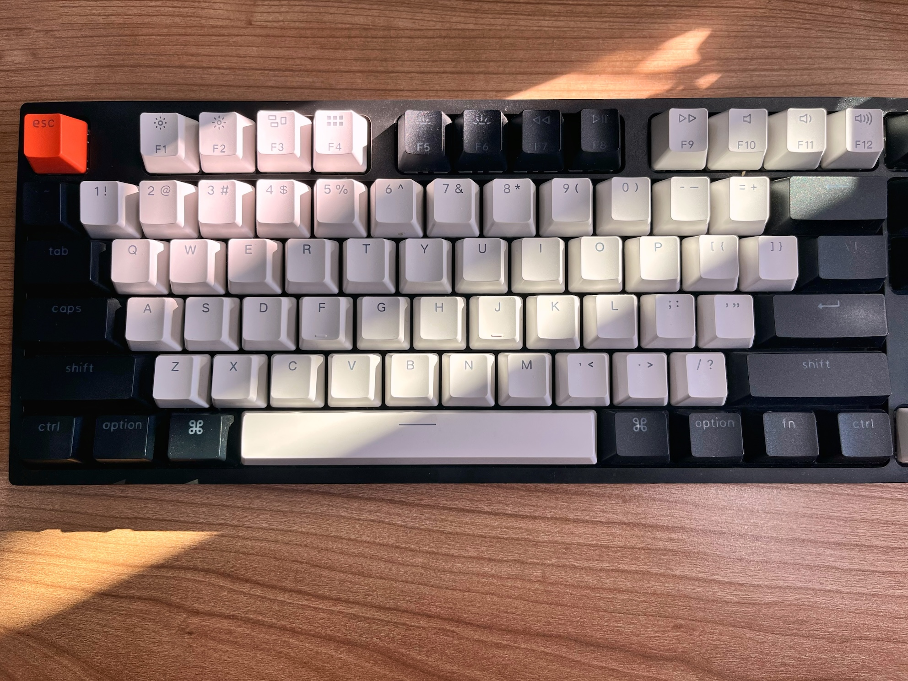

2023/11/18-2023/11/24 封面图由我拍摄。

这一周过得很平淡，以至于我发现我没有什么可以写的了。
## 停电
周一早上在工作的时候突然停电了，过了很久依然没有来电。等到了下午3 点依旧没有来电，于是当天就提前下班了。
这种体验还是挺奇妙的，所有人都被迫停下手头的工作，可以心安理得地放松，不会为此感到焦虑。
这算是生活中为数不多的松弛时刻，什么都做不了，同事们聚在一起聊天，玩起了 UNO。
平日里即便是是休息日，大家也不见得能好好休息，周末也有家务、社交这些事情要做，而且最关键的，周末如果我什么事都没做，躺了一天或是刷了一天手机，就会非常焦虑。

以前上初中的时候最期待的事情也是停电，那时候晚上要上晚自习，一到夏季和冬季就经常会停电，整个教室“刷”一下全黑了，学生们撑着黑暗开始捣乱，发出尖锐的叫声，整个教室乱成一团，学校没办法通常就会通知提前放学。不过如果遇到有考试的话，停电也没用，老师准备了蜡烛，学生就在烛光中写试卷。

## 锻炼
上周看了一篇文章 [为什么每个人都该做引体向上](https://blog.douchi.space/pull-up/#gsc.tab=0)，重新燃起了我想要锻炼的火苗。引体向上算是最方便的运动了，而且好处非常多，对于长期伏案久坐的人群来说，尤其有效果，而且我有点驼背，需要加强一下背部肌肉。想着想着就先下单了一个引体向上弹力带，然后下楼寻找单杠。

小区里有一块专门用于健身的场地，我印象中记得应该是有单杠的，不过过去之后才发现没有，只有一些给老人用的健身设施，还有一些小孩玩的游乐设施。紧接着去了隔壁小区，那里有一块空地被改造成了社区公园，有篮球场和乒乓球桌，想着应该有单杠，去了果然有。
引体向上难度还是蛮大的，尤其是对我这样的新手来说，上肢的力量太弱了，根本做不了一个标准的引体向上。等淘宝买的弹力带到了，终于可以好好锻炼了。加上弹力带之后效果立竿见影，一组可以连续做 5 个，做 5 组。现在一周练 3 次，一个月后再看看成果。
