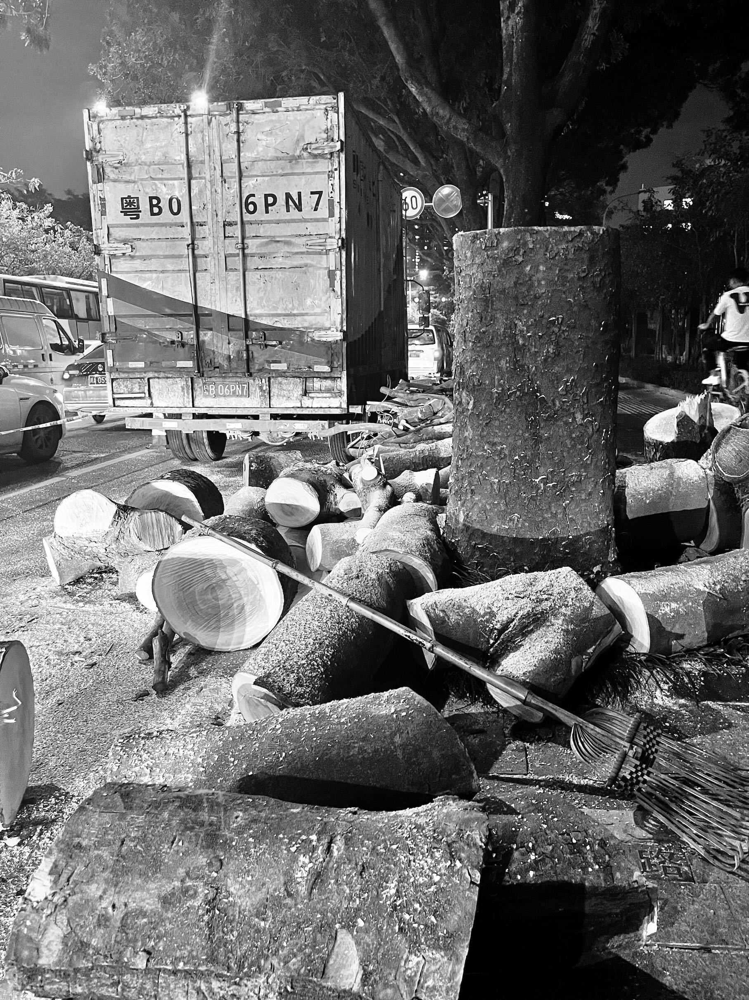

2023/12/02-2023/12/08 封面是在路边拍到的「杀死一棵树」

以前听过这样一个寓言故事。

渔夫在海边晒太阳，一位绅士走过来对他说：“天气这么好为什么不去捕鱼呢？”

渔夫说：“先生，捕鱼干什么呢？”

“捕鱼你就能挣很多钱啊？” 渔夫说：“挣钱又为了做什么呢？”

“挣钱你就可以买一艘更大的船”

“先生，买大船又做什么呢”

“这样你就可以打更多的鱼，挣更多的钱，” “那又能怎么样呢?”

“这样你就可以像我这样，在海边晒太阳”。

渔夫说：“先生，我现在正在这样做呢”

故事的本意是满足感和幸福感不需要通过追求更多财富和物质来实现，但是最近我有了新的思考。

沿着渔夫的思路继续下去，生活的终点大概是三和大神，他们不追求财富，没有钱了就去做一天日结的短工，结到工钱就呆在宿舍打游戏，很难说他们不快乐，但又很难说他们真的快乐。

最近观察到互联网上回家种地的呼声非常高，从李子柒这类田园视频有如此恐怖的播放量就可见一斑，都市白领的心里都有一个田园梦，幻想着有一天辞掉工作归隐田园。而在遥远的乡间土地上，有一位小镇做题家，他的梦想是考上好大学，找一份坐在办公室里就有工资的工作。

我是在农村长大的，我的父母大半辈子都在土地上劳作，倘若要问他们种地快乐吗？他们会说不快乐，种地太苦了。

种地不是一件轻松的差事，春天还没来之前就要把肥料背到地里，春天来了要开始翻地播种，出苗之后要补种，在夏天来之前施两次肥，秋天又得从地里把玉米收回来。然而仅靠种地是养不活一家人的，男人过了农忙时节要外出打工，女人则在家里再养些猪和牛。这些农活永远都是我的噩梦，我吃不了这种苦，大人们用来劝诫小孩好好读书的话就是：不好好读书就要一辈子干这些活。

寓言故事中绅士和渔夫晒的不是同样的太阳，绅士觉得无聊了坐着飞机就飞走了，渔夫晒了一天太阳回家后要为一家人的生计发愁。

在 V2EX 上看到一个帖子，一个程序员在通过特岗计划考回了河南三线乡镇当老师。他在帖子中晒出了自己的收入：教师每月工资 2200 ，外加延时服务费每学期几千块。帖子下面的评论中有很多人认为这样的生活挺好的，虽然工资少，但是生活幸福。老师这个职业可以干一辈子，工资还会随着年龄增长不断往上涨。但对我来说回老家躺平永远不会作为一种解决方案，我会羡慕他们，但不会跟随他们。在乡镇消费并不会比城市里低太多，淘宝不会因为你是三线城市给你打折，家里人生病需要大钱也不会因此少交一分。

看 B 站一位 UP 主的视频，在谈及家乡的美食时，他说：以前在家里每天都吃这些，并不觉得有多好吃，只有走出去，再回来，才发觉这些食物原来这么美味。

这是我花了很长时间才想通的道理：站在更高的地方，才能低头看到原来生活的幸福。
